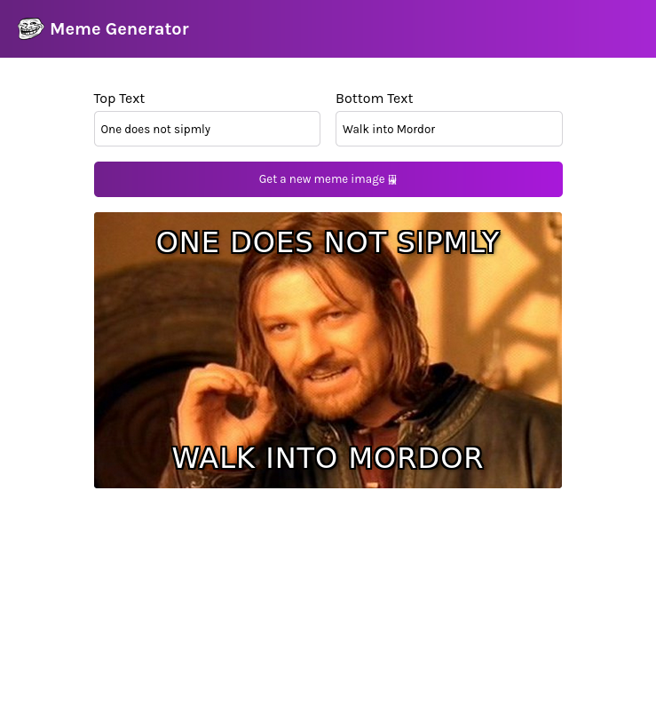

# Meme Generator 

Prosta aplikacja internetowa służąca do generowania memów. Projekt pobiera najpopularniejsze szablony obrazków z zewnętrznego API (Imgflip), a użytkownik może dynamicznie nakładać na nie własny tekst górny i dolny.

## Podgląd projektu

## Technologie

* **React 19**
* **Vite**
* **Tailwind CSS**
* **Fetch API**
